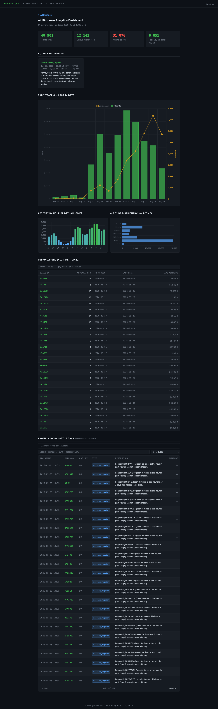
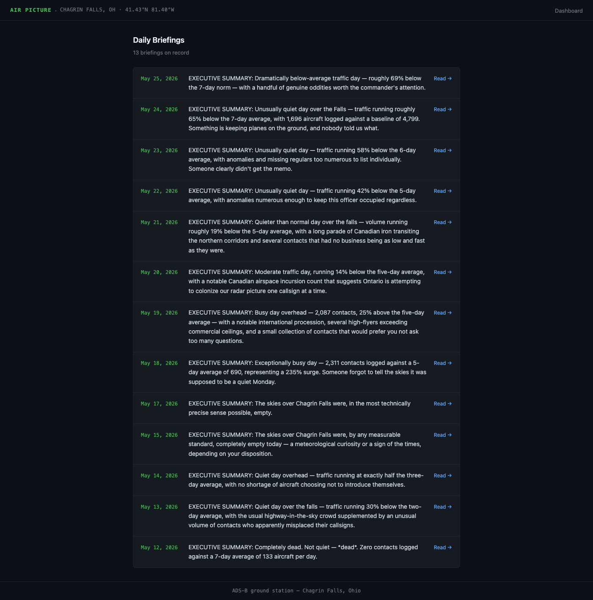

# site-screenshotter

Headless screenshots of local or remote HTML pages using Playwright + Chromium. Useful for keeping README images current without manual browser work.

**Requires Python 3.9+**

---

## Example output

<table>
<tr>
<td width="55%">
  
</td>
<td valign="top" width="45%">

### Analytics Dashboard

Full-page screenshot of a Chart.js dashboard — stat tiles, a dual-axis daily traffic chart, hourly heatmap, altitude distribution, and a sortable anomaly log with live search. `settle_ms` gives the charts time to finish rendering before the shutter fires.

</td>
</tr>
<tr>
<td width="55%">
  
</td>
<td valign="top" width="45%">

### Briefings Index

A simple list page — no JS, loads instantly. Quick mode picks this up automatically alongside the dashboard just by pointing at the `docs/` directory.

</td>
</tr>
</table>

---

## Setup

```bash
git clone https://github.com/billford/site-screenshotter.git
cd site-screenshotter

pip install -r requirements.txt
playwright install chromium
```

That's it — no other dependencies.

---

## Two ways to run it

### Quick mode

Point it at a directory and it screenshots every `.html` file it finds:

```bash
python screenshotter.py docs/
```

Output lands in `screenshots/` by default, one PNG per HTML file:

```
screenshots/index.png
screenshots/dashboard.png
screenshots/about.png
...
```

Use `--out` to change the output directory:

```bash
python screenshotter.py docs/ --out shots/
```

### Config mode

For more control — specific pages, custom output paths, remote URLs:

```bash
python screenshotter.py                        # reads config.json in current dir
python screenshotter.py --config myconf.json   # explicit config file
```

`config.json`:

```json
{
  "viewport_width": 1400,
  "viewport_height": 900,
  "settle_ms": 1500,
  "full_page": true,
  "pages": [
    {
      "url": "file:///Users/you/myproject/docs/index.html",
      "output": "screenshots/index.png"
    },
    {
      "url": "file:///Users/you/myproject/docs/dashboard.html",
      "output": "screenshots/dashboard.png"
    },
    {
      "url": "https://example.com",
      "output": "screenshots/example-live.png"
    }
  ]
}
```

#### Config options

| Key | Default | Description |
|-----|---------|-------------|
| `viewport_width` | `1400` | Browser window width in pixels |
| `viewport_height` | `900` | Browser window height in pixels |
| `settle_ms` | `1500` | Extra wait after page load (ms). Increase if JS charts or animations are still rendering. |
| `full_page` | `true` | Capture the full scrollable page, not just the visible viewport |

---

## Wiring into a build script

Run it at the end of your build and commit the updated PNGs automatically:

```bash
# build_and_push.sh

python build_site.py

python screenshotter.py --config config.json
git add screenshots/
git diff --cached --quiet || git commit -m "screenshots: update"

git push
```

---

## How it works

Playwright launches a headless Chromium instance and navigates to each URL. `wait_until="networkidle"` holds until the page stops making network requests, then `settle_ms` adds a fixed delay on top — giving client-side rendering (Chart.js, D3, etc.) time to finish drawing before the shutter fires. Both `file://` and `http(s)://` URLs work.
